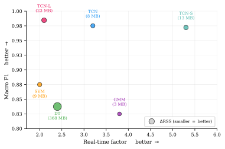
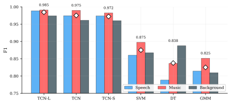

# Real-Time Speech / Music / Background Classifier

**A causal, streaming audio classifier that matches a published TCN reference within 0.003 macro F1 — at 1/7 the parameters and ~21× less per-frame compute.**

[](LICENSE)
[](.python-version)
[](pyproject.toml)
[](https://github.com/astral-sh/uv)

Classifies streaming audio, frame by frame and **causally** (no look-ahead), into three
classes — **Speech**, **Music**, and **Background** (silence + ambient noise). The third class
lets the model run standalone as a codec/pipeline front end without a separate voice-activity
gate. The work extends the two-class formulation of its reference papers to three classes and
reproduces a published causal TCN, then pushes it in two directions: a stronger model
(**TCN-L**, macro F1 0.9846) and a tiny one (**TCN-S**, ~4.6K parameters) that nearly matches
the reference while running **5.3× faster than real time on a single thread of a 7-year-old
laptop CPU**.

Six trained models ship end-to-end: three classic baselines (decision tree, GMM, SVM) and
three causal TCN variants, evaluated on a purpose-built 100-hour dataset with cluster-bootstrap
confidence intervals.



*Accuracy (macro F1) against speed (real-time factor) on a single CPU thread; bubble size is the resident-memory delta. TCN-S (top-right) is the fastest model while staying within the top accuracy tier.*

## Results

Frame-level test-split macro F1 (95% cluster-bootstrap CI), full 100-hour tier:

| Model | Macro F1 | Params | Notes |
|---|---|---:|---|
| **TCN-L** | **0.9846** [0.9793, 0.9883] | 389 K | Δ² frontend + conv1d preprocessor + LSTM head — strongest model |
| TCN (reference) | 0.9752 [0.9687, 0.9793] | 33 K | Faithful reproduction of Lemaire & Holzapfel (2019) |
| **TCN-S** | **0.9722** [0.9652, 0.9769] | **4.6 K** | Matches the reference within 0.003 F1 at 1/7 the params — **primary contribution** |
| SVM | 0.8750 [0.8519, 0.8926] | 521 K | Khonglah & Prasanna (2016) baseline |
| Decision Tree | 0.8376 [0.8213, 0.8495] | — | Lavner & Ruinskiy (2009) baseline |
| GMM | 0.8250 [0.7950, 0.8473] | 474 | Khonglah & Prasanna (2016) baseline |

The TCN family clusters at 0.97–0.98; the three traditional references trail by ~10 points.



*Per-class F1 (Speech / Music / Background) with the macro-F1 marker above each model.*

**Efficiency (Intel i5-8300H, single thread).** TCN-S runs at **5.3× real time** with a 4.4 ms
computation delay, 13 MB resident footprint, and ~545 K MACs/frame — versus 11.6 M MACs/frame
for the reference TCN it matches. Steady-state total latency stays ≤ 34 ms.

## What's in here

- **Six trained, streaming models** — DT / GMM / SVM classic baselines and TCN / TCN-L / TCN-S,
  all doing per-frame causal inference with matched preprocessing.
- **A 100-hour, 3-class dataset** built from public sources with a reproducible pipeline
  (speech/music/background at 40/40/20, seven balanced music genres, synthetic multi-speaker
  and speech-over-noise/music augmentation).
- **A full experimental program** — frontend, preprocessor, backbone, temporal-head, and
  combined ablations, plus a lightweight-variant search that produced TCN-S, and a CPU /
  symbolic-complexity cost analysis.
- **A live web demo** (Reflex) that streams mic or file input through any of the six models
  (see the demo disclosure in [REPRODUCTION.md](REPRODUCTION.md#demo-disclosure)).

## Quickstart

```bash
uv sync                                          # install pinned deps
uv run smclassifier nn tcn-s smoke-test          # ~5 s synthetic end-to-end check
```

That runs the smallest model on a synthetic clip with no dataset or network access. For full
evaluation, weights download, dataset access, the CLI reference, and configuration, see
**[REPRODUCTION.md](REPRODUCTION.md)**.

## Learn more

- **[REPRODUCTION.md](REPRODUCTION.md)** — setup, weights & dataset, evaluation walkthrough,
  full CLI reference, configuration, demo disclosure.
- **[src/README.md](src/README.md)** — code architecture: the CLI surface, shared vs.
  model-specific modules, and the TOML-driven variant factory.
- **`thesis/`** — the LaTeX source, figures, and compiled PDF of the accompanying bachelor thesis.

The three reference architectures follow Lavner & Ruinskiy (EURASIP 2009),
Khonglah & Prasanna (DSP 2016), and Lemaire & Holzapfel (ISMIR 2019); deviations from each
paper are documented in the thesis.

## License

[MIT](LICENSE) © 2026 Marek Hric
